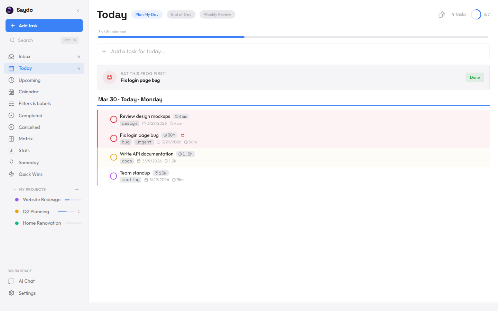
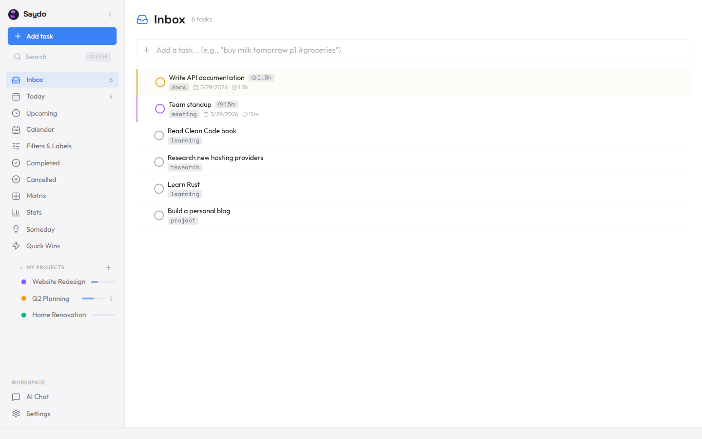
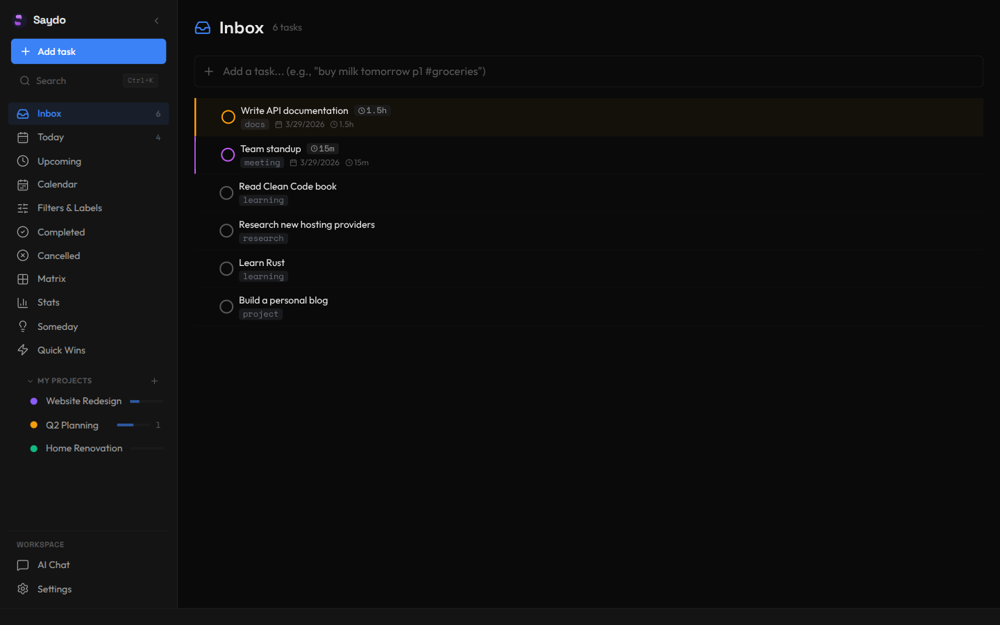
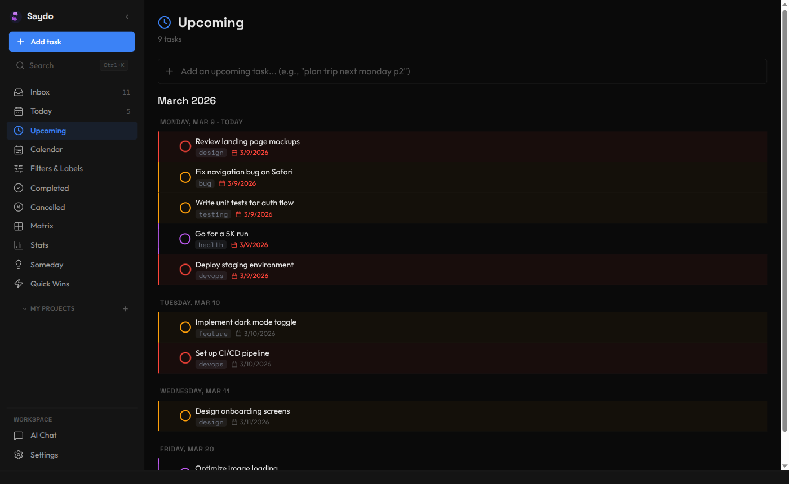
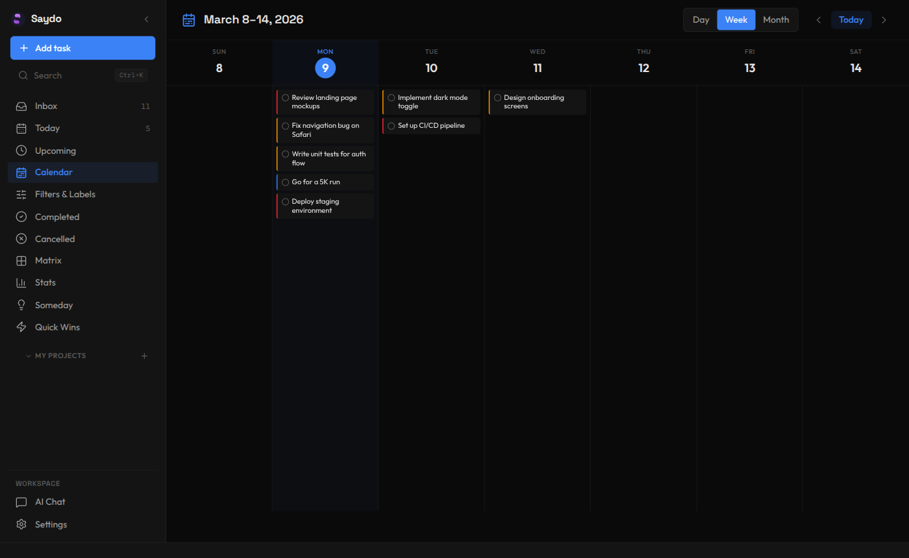
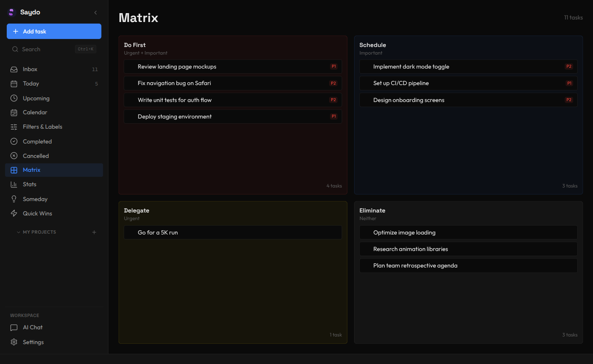
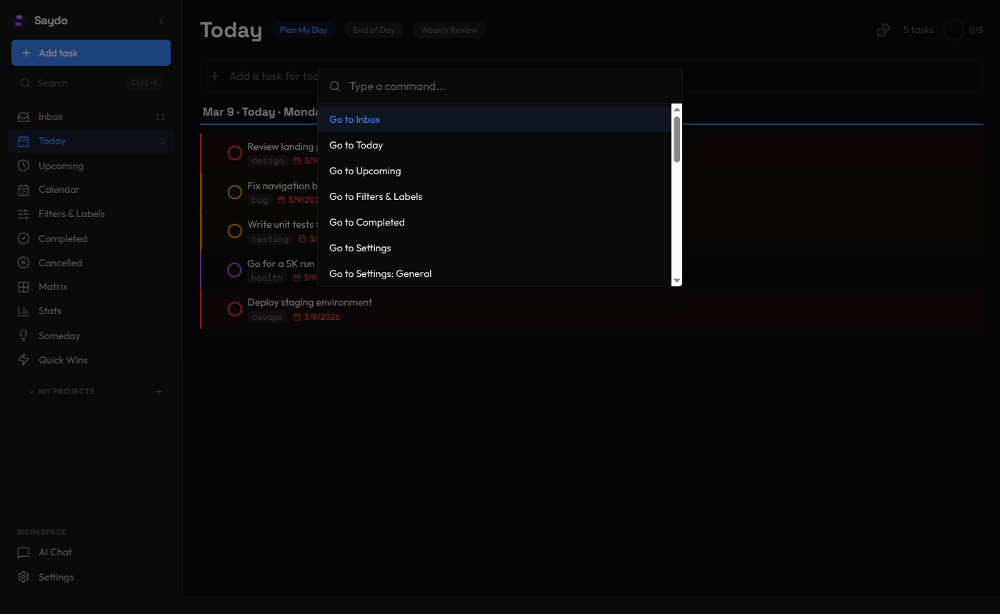
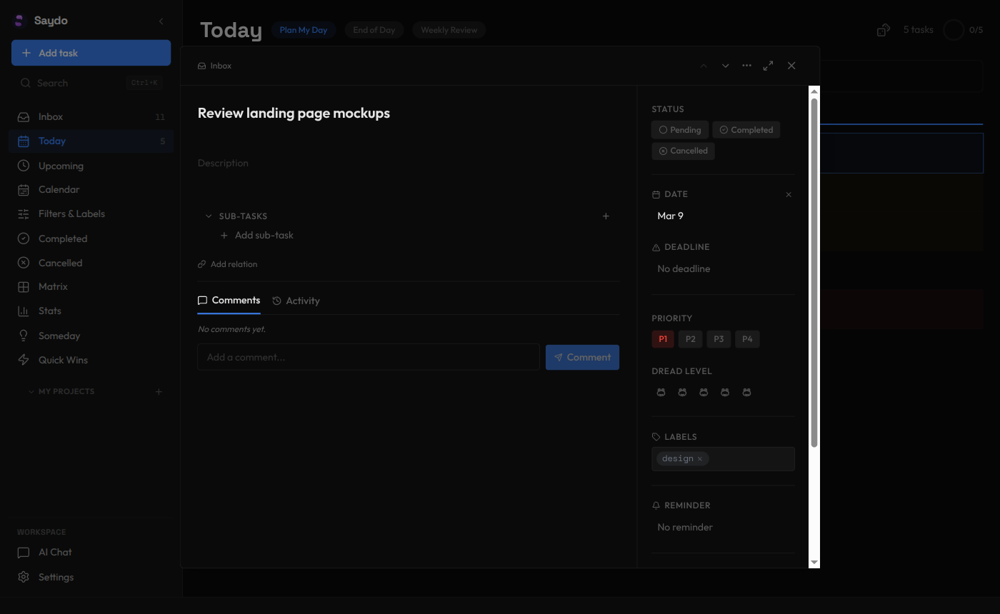
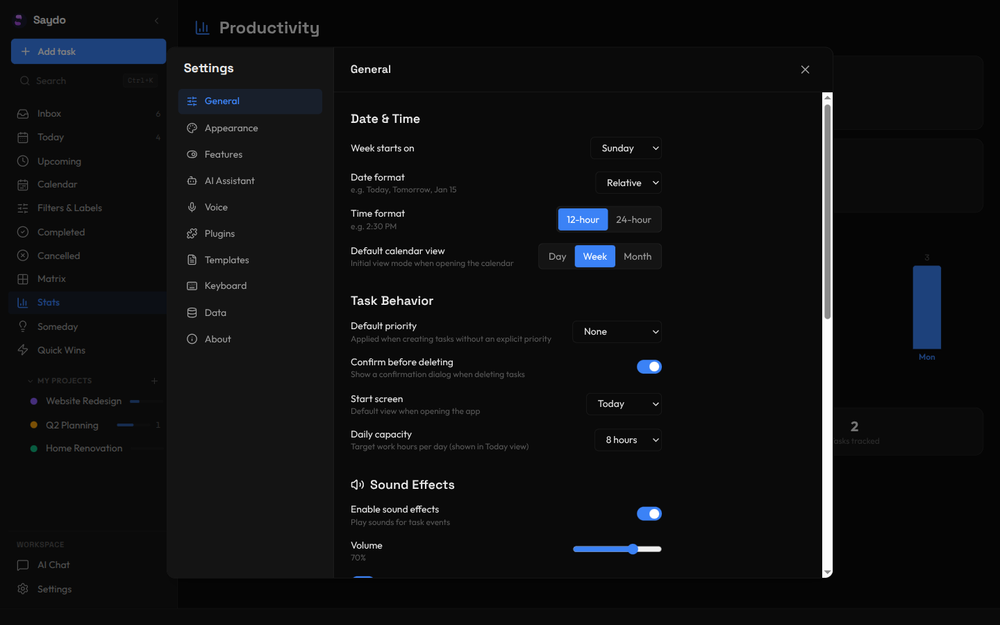
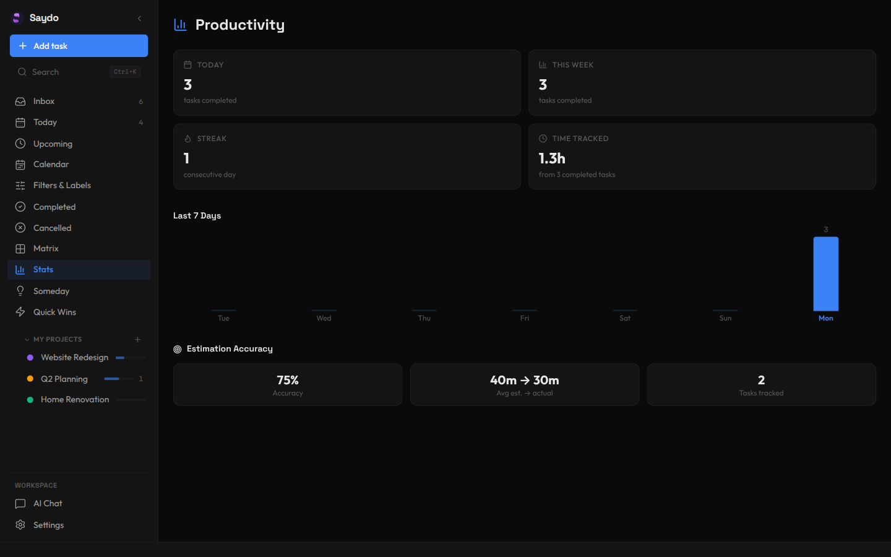

<div align="center">


# Junban

**A local-first task manager with AI, voice, and plugins.**<br />
Fast for everyday task management, flexible when you need more power,<br />
and private by default because your data stays on your machine.

No accounts. No tracking. No mandatory cloud.

<p>
  <a href="https://github.com/Artificial-Source/Junban">Home</a> &nbsp;&middot;&nbsp;
  <a href="docs/guides/SETUP.md">Setup</a> &nbsp;&middot;&nbsp;
  <a href="docs/guides/ARCHITECTURE.md">Architecture</a> &nbsp;&middot;&nbsp;
  <a href="docs/guides/RELEASES.md">Releases</a> &nbsp;&middot;&nbsp;
  <a href="docs/reference/plugins/API.md">Plugin API</a> &nbsp;&middot;&nbsp;
  <a href="docs/product/README.md">Product Docs</a> &nbsp;&middot;&nbsp;
  <a href="docs/product/roadmap.md">Roadmap</a>
</p>

[](https://github.com/Artificial-Source/Junban/actions/workflows/ci.yml)
[](LICENSE)
[](https://github.com/Artificial-Source/Junban/stargazers)

An open-source project by [Artificial Source](https://github.com/Artificial-Source).

<br />

<picture>
  <source media="(prefers-color-scheme: dark)" srcset="screenshots/today-dark.png" />
  <source media="(prefers-color-scheme: light)" srcset="screenshots/today-light.png" />
  
</picture>

</div>

<br />

<details>
<summary><strong>More screenshots</strong></summary>

<br />

<div align="center">

|                               Inbox (light)                               |                              Inbox (dark)                               |
| :-----------------------------------------------------------------------: | :---------------------------------------------------------------------: |
|  |  |

|                                Upcoming                                |                                Calendar                                |
| :--------------------------------------------------------------------: | :--------------------------------------------------------------------: |
|  |  |

|                         Eisenhower Matrix                          |                                   Command Palette                                    |
| :----------------------------------------------------------------: | :----------------------------------------------------------------------------------: |
|  |  |

|                                 Task Detail                                  |                                Settings                                |
| :--------------------------------------------------------------------------: | :--------------------------------------------------------------------: |
|  |  |



</div>

</details>

---

## Download

Download the latest desktop release here:

<https://github.com/Artificial-Source/Junban/releases/latest>

Pick the file for your platform:

| Platform              | Download this file         |
| --------------------- | -------------------------- |
| Windows               | `.exe` installer or `.msi` |
| macOS (Apple Silicon) | `.dmg` with `aarch64`      |
| macOS (Intel)         | `.dmg` with `x64`          |
| Linux (Debian/Ubuntu) | `.deb` with `amd64`        |
| Linux (portable)      | `.AppImage` with `amd64`   |

Install notes:

- Windows: download the installer and open it.
- macOS: download the `.dmg`, open it, and move Junban to `Applications`.
- Linux: use the commands below, or download the asset in your browser and run the matching install step.

Linux quick install from the latest release:

```bash
curl -fsSL https://raw.githubusercontent.com/Artificial-Source/Junban/main/scripts/install-linux.sh | sh
```

The installer prints the detected distro, architecture, and selected install path. It uses the `.deb` on Debian/Ubuntu and the portable AppImage on other Linux distributions. It also refreshes the Junban launcher entry so the app menu shows a single `Junban` result. The `.deb` path explains and asks before using `sudo` because `apt-get` installs a system package.

If you want to choose the install type yourself:

```bash
curl -fsSL https://raw.githubusercontent.com/Artificial-Source/Junban/main/scripts/install-linux.sh | sh -s -- --choose
```

To install without `sudo`, force the AppImage path:

```bash
curl -fsSL https://raw.githubusercontent.com/Artificial-Source/Junban/main/scripts/install-linux.sh | sh -s -- --appimage
```

If you prefer the browser flow, download the `.deb` or `.AppImage` from the release page above and run the matching install step manually.

Desktop remote access:

- Packaged desktop installs can expose a personal web UI from inside the app.
- Open `Settings -> Data -> Remote Access`, choose a port, and start the server.
- Optional password protection is built in, and you can enable auto-start so remote access comes up when the app opens.
- This is designed for trusted-network access such as Tailscale.
- When remote access is running, local desktop changes that write data are blocked in the desktop window, including quick capture and import, while remote-access controls remain available there.
- Only one remote browser session is active at a time. Stop and restart remote access from the desktop app to switch devices.

## Why Junban

Most task managers force a tradeoff: simple but limited, or powerful but bloated. Junban is built to stay fast for everyday use while still giving you AI, voice, and extensibility when you want them.

- Capture tasks in plain English: `buy milk tomorrow 3pm p1 #groceries +shopping`
- Use an optional AI assistant that can work with your real tasks, projects, and schedule
- Talk instead of type with built-in voice features
- Extend the app with plugins instead of waiting for core features
- Keep your data local and portable with SQLite or Markdown storage
- Use the same core across the desktop app, API server, CLI, and MCP server

## Features

### Natural language input

Dates, priorities, tags, recurrence, and projects can be parsed from plain text.

```text
buy milk tomorrow 3pm p1 #groceries +shopping
finish report next friday p2 #work
call dentist 9am #health
```

### AI assistant

Junban includes an optional AI assistant with:

- Chat-driven task and project management
- Built-in tool calling for planning, querying, organization, and updates
- Pluggable providers, including cloud and local options
- Task-aware responses grounded in your actual Junban data

Nothing AI-related runs unless you configure it.

### Voice

Voice support includes speech-to-text, text-to-speech, and voice activity detection.

Current built-in providers include browser, hosted, and local model paths. See `docs/reference/backend/VOICE.md` for the up-to-date provider matrix.

### Plugins

Junban has a plugin system with:

- Manifest-based discovery
- Sandboxed execution
- Permission-gated APIs
- Commands, views, panels, settings, and AI extension points

Plugin author docs:

- `docs/reference/plugins/API.md`
- `docs/reference/plugins/EXAMPLES.md`

### Interfaces

- React desktop/web UI
- Standalone Hono API server
- Commander-based CLI with both simple task commands and full agent tool execution
- MCP server for external AI agents

### Agent tools

Junban is designed so external AI agents can help manage tasks without sending your local data to a mandatory cloud service.

- `junban` gives humans and terminal-controlled agents a local command line interface.
- `junban tools` lists the registered AI/agent tools, including task, project, tag, planning, organization, reminders, and analytics tools.
- `junban tool <name> --args '{...}'` runs one registered tool with validated JSON arguments.
- `junban-mcp` starts the local MCP server for Claude Desktop and other MCP-compatible agents.
- In the desktop app, open `Settings -> Agent Tools` to copy or download MCP config and a small agent skill/instructions file.

Examples:

```bash
junban add "submit invoice tomorrow p1 #finance"
junban list --today --json
junban tools --json
junban tool create_task --args '{"title":"Review roadmap","priority":2}' --json
junban-mcp
```

Docs:

- CLI guide: `docs/how-to/use-cli.md`
- MCP setup: `docs/how-to/connect-claude-desktop.md`

## Development

See `docs/guides/SETUP.md` for the full setup guide.

Quick start:

```bash
git clone https://github.com/Artificial-Source/Junban.git
cd Junban
corepack enable
pnpm install
pnpm setup:dev
pnpm dev
```

One-line setup:

```bash
git clone https://github.com/Artificial-Source/Junban.git && cd Junban && corepack enable && pnpm install && pnpm setup:dev && pnpm dev
```

Useful commands:

```bash
pnpm dev
pnpm dev:full
pnpm server
pnpm build
pnpm test
pnpm test:e2e
pnpm check
pnpm tauri:dev
pnpm mcp
pnpm cli
```

Source-run dev commands use an isolated dev profile by default. Packaged desktop installs use Tauri app data instead of the repo-local dev database.

## Tech Stack

| Area     | Choice                                                 |
| -------- | ------------------------------------------------------ |
| Runtime  | Node.js 22, TypeScript                                 |
| Frontend | React 19, Tailwind CSS 4, Vite 6                       |
| Desktop  | Tauri v2                                               |
| API      | Hono                                                   |
| Database | SQLite via better-sqlite3 and sql.js                   |
| ORM      | Drizzle                                                |
| AI       | Provider abstraction with cloud and local integrations |
| Voice    | Browser, hosted, and local adapters                    |
| CLI      | Commander.js                                           |
| Tests    | Vitest, Testing Library, Playwright                    |

## Docs

| Domain / Entry             | Purpose                                                                                                                    |
| -------------------------- | -------------------------------------------------------------------------------------------------------------------------- |
| `docs/README.md`           | Canonical docs index and single source of truth for ownership mapping/doc-governance routing                               |
| `docs/product/README.md`   | Product-doc index for mission, roadmap, status, and PRD-style planning                                                     |
| `docs/guides/`             | Contributor and maintainer workflows (setup, architecture, releases, security)                                             |
| `docs/reference/README.md` | Technical-reference library index for `docs/reference/frontend/`, `docs/reference/backend/`, and `docs/reference/plugins/` |
| `AGENTS.md`                | Quick-start for coding agents                                                                                              |
| `CLAUDE.md`                | Contributor and agent development guide                                                                                    |

Historical compatibility:

- `docs/planning/ROADMAP.md` remains available as a legacy roadmap alias that redirects into `docs/product/`.
- Lifecycle and retirement policy for legacy stubs: `docs/guides/LEGACY_COMPATIBILITY_POLICY.md`.

Common docs:

- `docs/guides/CONTRIBUTING.md` for contributor workflow and branch targeting
- `docs/guides/SECURITY.md` for security model and reporting guidance
- `docs/guides/SETUP.md` for local development setup

## Contributing

See `docs/guides/CONTRIBUTING.md`. Run `pnpm check` before opening a PR.

Current branch flow:

- `developer` is the integration branch for normal work.
- `main` is reserved for production-ready release promotions and hotfixes.
- Desktop releases are tagged from `main` as `v<version>`.

## License

MIT
