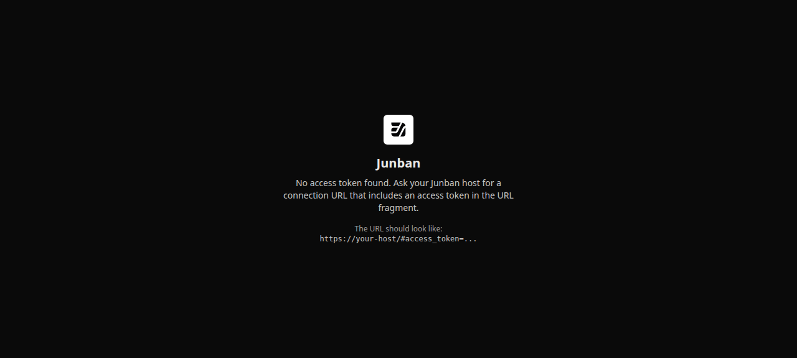
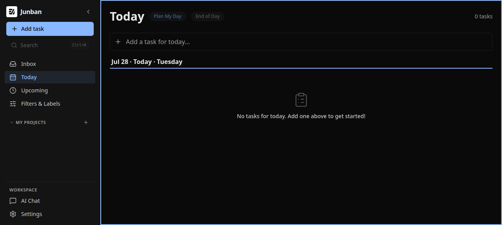

# Dogfood Report: Junban Phase 1 Tailnet

| Field       | Value                                                                                                                                        |
| ----------- | -------------------------------------------------------------------------------------------------------------------------------------------- |
| **Date**    | 2026-07-28                                                                                                                                   |
| **App URL** | Private Tailscale Serve HTTPS endpoint (hostname intentionally omitted)                                                                      |
| **Session** | `junban-phase1-tailnet`                                                                                                                      |
| **Scope**   | Source-free Phase 1 Tailnet bootstrap, Today CRUD, persistence, responsive layout, and browser diagnostics against the optimized Rust server |

## Summary

| Severity  | Count |
| --------- | ----: |
| Critical  |     0 |
| High      |     0 |
| Medium    |     1 |
| Low       |     0 |
| **Total** | **1** |

The real loopback Rust listener was published through Tailscale Serve over private HTTPS with the exact MagicDNS Host allowlisted. Fresh-session fragment bootstrap, fragment scrubbing, create, edit, complete, uncomplete, persistence in a second browser session, delete, desktop/mobile layouts, and graceful shutdown passed. Browser console and error logs were empty. One recoverable connection-flow issue was reproduced, fixed, and retested.

## Issues

### ISSUE-001: Connection token is ignored after same-page fragment navigation

| Field           | Value                                          |
| --------------- | ---------------------------------------------- |
| **Severity**    | medium                                         |
| **Category**    | functional / UX                                |
| **URL**         | Tailnet root connection screen                 |
| **Repro Video** | [`issue-001-repro.webm`](issue-001-repro.webm) |
| **Status**      | Fixed and retested                             |

**Description**

When a user first opens the host without a token and then adds the supplied `#access_token=...` fragment to that already-loaded page, the browser performs same-document fragment navigation. Junban does not consume or scrub the new fragment, does not store the token, and remains on the connection screen. Opening the complete connection URL in a fresh browser navigation works. The existing screen therefore leaves a plausible recovery path broken.

**Repro Steps**

1. Open the Tailnet root URL without a token and observe the connection screen.
   
2. Add the supplied `#access_token=...` fragment to the same page without forcing a reload.
3. **Observe:** the fragment remains present and Junban still reports that no access token was found.
   

Machine-readable observation: [`issue-001-result.json`](issue-001-result.json).

**Resolution and retest**

The application now listens for same-page fragment navigation, consumes an exact connection fragment, scrubs it, and transitions into the authenticated shell without a reload. A focused Playwright regression passed. The same scenario was repeated through the real private Tailscale Serve endpoint: all booleans in [`issue-001-retest.json`](issue-001-retest.json) are true, browser console/error logs are empty, and the authenticated result is captured below.

## Passed evidence

- [`01-connection-snapshot.txt`](01-connection-snapshot.txt): unauthenticated boundary.
- [`02-scrubbed-url.txt`](02-scrubbed-url.txt): a fresh token-bearing navigation removes the fragment.
- [`03-created-snapshot.txt`](03-created-snapshot.txt): authenticated creation through private HTTPS.
- [`04-dialog-snapshot.txt`](04-dialog-snapshot.txt): task editing dialog.
- [`06-reload-snapshot.txt`](06-reload-snapshot.txt): persisted task in a fresh browser session after server-backed mutation.
- [`07-mobile-snapshot.txt`](07-mobile-snapshot.txt): responsive 390×844 task view.
- [`08-mobile-dialog-snapshot.txt`](08-mobile-dialog-snapshot.txt): mobile task dialog and delete path.
- `03-*`, `07-*`, and `08-*` browser console/error files are empty.
